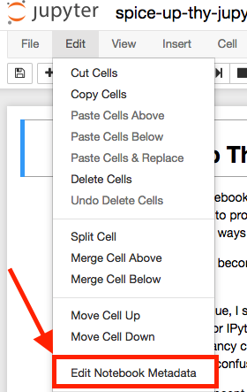
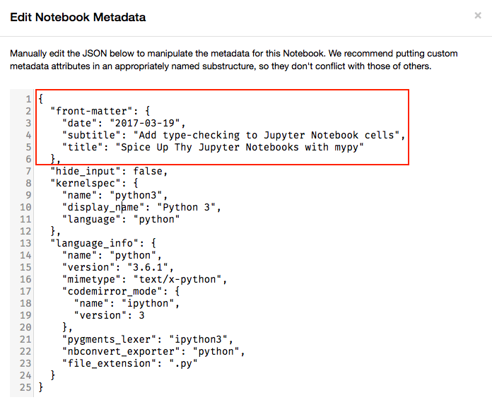

# knowsuchagency.github.io

With fabric.py and a `notebooks` folder at the root of your project, you can have the jupyter
notebooks in the `notebooks` folder render to markdown files for [hugo](https://gohugo.io/) to then render to html.

Just make sure to have an appropriate [front-matter](https://gohugo.io/content/front-matter/) object in the notebook's
metadata. 

In the jupyter interface, under the `Edit` tab, select `Edit Notebook Metadata`

Then edit the metadata as shown

That's it!

Now from the root of your directory, you can use [fabric](https://www.google.com/search?q=python+fabric&oq=python+fabric&aqs=chrome.0.69i59j69i60j69i57j69i61j69i60l2.1889j0j9&sourceid=chrome&ie=UTF-8)
to render your notebooks or even have them re-rendered as you change them
by running commands such as `fab serve` from the directory root.

You will need Python 3, jupyter, fabric, and watchdog installed.